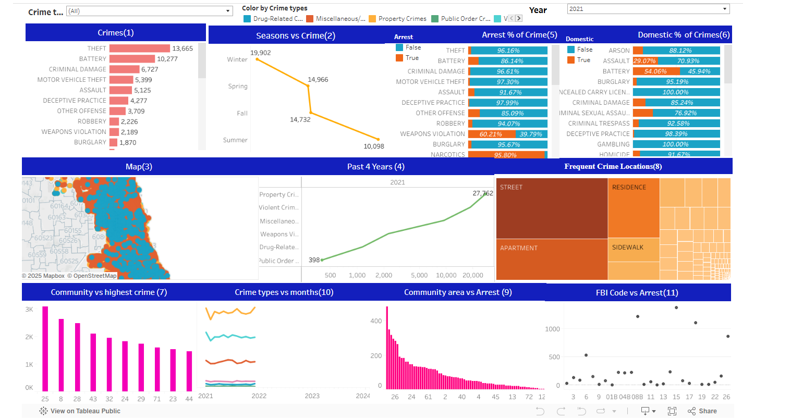

# 🕵️ Chicago Crime Analysis

## Overview

This project analyzes crime data in Chicago to identify patterns, trends, and hotspots, enabling stakeholders to make informed decisions for improving public safety. The interactive dashboard provides insights into crime categories, locations, and temporal patterns.

**[🌐 View Dashboard on Tableau Public](https://public.tableau.com/app/profile/dharmik.shah2873/viz/Chicago_Crime_Analysis_17136777823450/ChicagoCrimeAnalysis)**

---

## Key Features

- **Interactive Filters**: Dive deep into crime data by category, time, and location.
- **Hotspot Analysis**:
  - Crime-prone areas across Chicago.
  - Temporal distribution of criminal activities.
- **Dynamic Visuals**:
  - Crime trends over the years.
  - Heatmaps of high-crime regions.
  - Comparison of crime types and frequencies.

---

## Repository Contents

- 📂 **Dataset**: `dataset/chicago_crime_data.csv`
- 📂 **Presentation**: `Presentation/Chicago_Crime_Insights.pdf`
- 📂 **Images**: `Images/`

---

## Insights from the Dashboard

- 🗺️ **Crime Hotspots**: Downtown Chicago and specific neighborhoods show higher crime rates.
- 🕒 **Temporal Trends**: Crimes peak during certain hours and seasons.
- 🔍 **Category Insights**: Theft and assault are the most reported crimes, with notable variations by area.
- 🌟 **Actionable Insights**: Improved resource allocation during high-crime hours and targeted interventions in hotspots.

---

## Tools Used

- **Tableau Public**: Dashboard creation and visualization.
- **Python**: Data cleaning and preprocessing.
- **Tableau**: Exploratory data analysis.

---

## How to Use

1. **View the Dashboard**:
   - Access the interactive dashboard directly on [Tableau Public](https://public.tableau.com/app/profile/dharmik.shah2873/viz/Chicago_Crime_Analysis_17136777823450/ChicagoCrimeAnalysis).
2. **Explore Locally**:
   - Clone this repository:
     ```bash
     git clone https://github.com/your-repo-name.git
     ```
   - Use the provided dataset (`dataset/chicago_crime_data.csv`) for further analysis.

---

## Visual Preview

### 📊 Dashboard Overview



---

## License

This project is licensed under [MIT License](LICENSE).

---

## Connect

For any questions or suggestions, feel free to reach out!

- **Author**: Dharmik Shah
- **GitHub**: [dharmik2101](https://github.com/dharmik2101)
- **Tableau Public**: [Dharmik Shah](https://public.tableau.com/app/profile/dharmik.shah2873)
